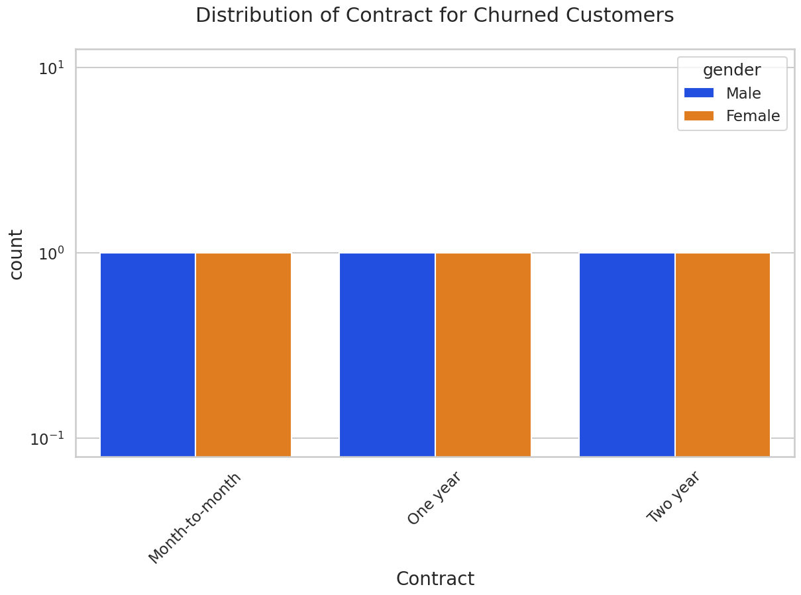
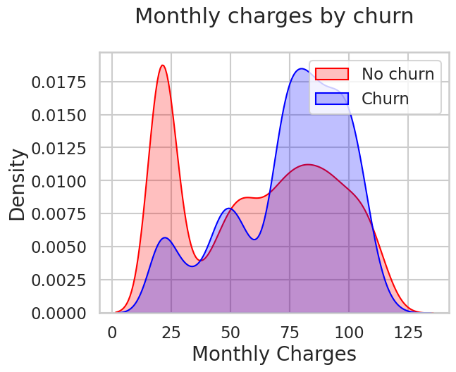
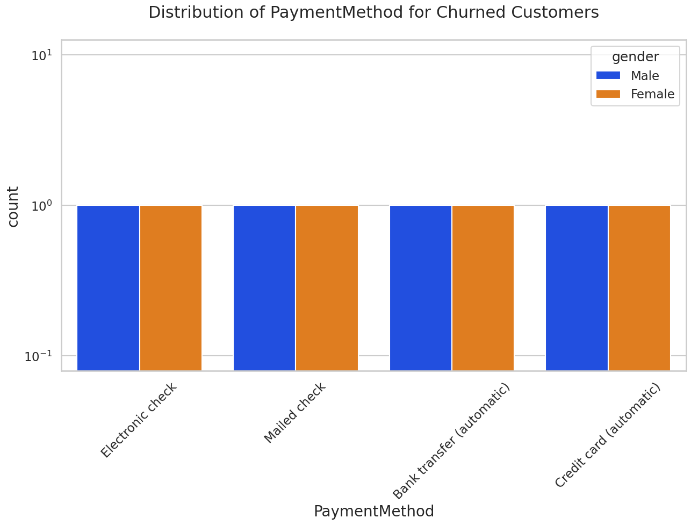
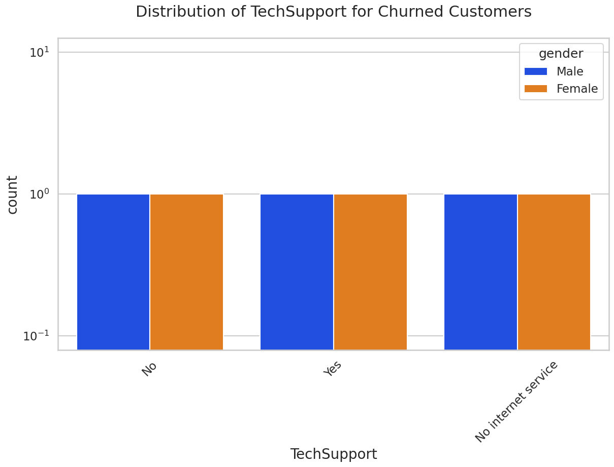
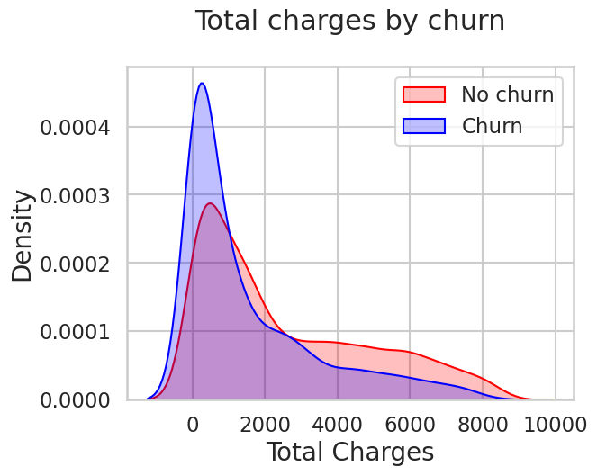

# 📊 Telco Customer Churn Analysis

A complete **data analysis project** exploring telecom customer behavior to identify key factors influencing **customer churn**, using Python, Pandas, Seaborn, and Matplotlib.

---

## 🧠 Project Overview

Customer churn (loss of customers) is a critical issue for telecom companies.  
This project aims to uncover **why customers leave** and what factors drive their decisions.

> **Goal:** Analyze churn patterns, visualize customer trends, and support retention strategy insights.

---

## ⚙️ Tech Stack

- **Language:** Python 🐍  
- **Libraries:** Pandas, NumPy, Seaborn, Matplotlib  
- **IDE:** PyCharm (or Jupyter/Colab)  
- **Dataset:** `CustomerChurn.csv`  

---

## 📦 Project Structure

```
Customer_Churn_Project/
│
├── images/
    ├── churn_distribution.png
    ├── contract_churn.png
    ├── Gender_churn.png
    ├── monthly_charges_by_churn.png
    ├── payment_churn.png
    └── senior_citizen.png
    ├── tech_support.png
    └── total_charges_by_churn.png
├── Customer_Churn_Analysis.ipynb
├── README.md
└── tel_churn.csv
```

---


## 📂 Dataset Information

- **File:** `CustomerChurn.csv`  
- **Records:** 7,043  
- **Columns:** 21  
- **Target:** `Churn` (Yes/No)

| Feature | Description |
|----------|-------------|
| tenure | Number of months customer stayed |
| MonthlyCharges | Monthly bill amount |
| TotalCharges | Total amount paid |
| Contract | Contract type |
| InternetService | Type of internet service |
| OnlineSecurity | Whether online security is included |
| TechSupport | Availability of technical support |
| Partner | Whether the customer has a partner |
| Churn | Target variable |

---

## 🧾 Steps Followed

### 🔹 1. Data Loading
```python
import pandas as pd
telco_base_data = pd.read_csv('CustomerChurn.csv')
print(telco_base_data.head())
```

---

### 🔹 2. Data Cleaning

Convert `TotalCharges` to numeric and handle missing values.
```python
telco_base_data['TotalCharges'] = pd.to_numeric(telco_base_data['TotalCharges'], errors='coerce')
telco_base_data.dropna(inplace=True)
```

---

### 🔹 3. Exploratory Data Analysis (EDA)

#### Churn Distribution
```python
# creating a bar chart to represent the chart
import os
if not os.path.exists('images'):
    os.makedirs('images')
telco_base_data.Churn.value_counts().plot(kind = 'bar', figsize = (8, 4))
plt.xlabel('Churn')
plt.ylabel('Count')
plt.title('Churn Count')
plt.savefig("images/churn_distribution.png", bbox_inches="tight")
plt.show()
```


---

#### Contract Type vs Churn
```python
def uniplot(df, col, title, hue = None):

  sns.set_style('whitegrid')
  sns.set_context('talk')
  plt.rcParams['axes.labelsize'] = 20
  plt.rcParams['axes.titlesize'] = 22
  plt.rcParams['axes.titlepad'] = 30

  temp = pd.Series(data = hue)
  fig, ax = plt.subplots()
  width = len(df[col].unique()) + 7 + 4*len(temp.unique())
  fig.set_size_inches(width, 8)
  plt.xticks(rotation = 45)
  plt.yscale('log')
  plt.title(title)
  ax = sns.countplot(data = df, x= col, order=df[col].value_counts().index,hue = hue,palette='bright')

plt.show()

uniplot(new_df1_target1,col='Contract',title='Distribution of Contract for Churned Customers',hue='gender')
plt.savefig("images/contract_churn.png", bbox_inches="tight")
```



---

#### Gender Churn
```python
uniplot(new_df1_target0,col='Partner',title='Distribution of Gender for Non Churned Customers',hue='gender')
plt.savefig("images/Gender_churn.png", bbox_inches="tight")

```


---

### 🔹 4. Numerical Feature Analysis

#### Monthly Charges by Churn
```python
Mth = sns.kdeplot(telco_data_dummies.MonthlyCharges[(telco_data_dummies['Churn'] == 0)], color = 'Red', shade = True)
Mth = sns.kdeplot(telco_data_dummies.MonthlyCharges[(telco_data_dummies['Churn'] == 1)], ax = Mth, color = 'Blue', shade = True)
Mth.legend(['No churn', 'Churn'], loc = 'upper right')
Mth.set_ylabel('Density')
Mth.set_xlabel('Monthly Charges')
Mth.set_title('Monthly charges by churn')
plt.savefig("images/monthly_charges_by_churn.png", bbox_inches="tight")
```



---

```python
uniplot(new_df1_target1,col='PaymentMethod',title='Distribution of PaymentMethod for Churned Customers',hue='gender')
plt.savefig("images/payment_churn.png", bbox_inches="tight")
```



---
```python
uniplot(new_df1_target1,col='SeniorCitizen',title='Distribution of SeniorCitizen for Churned Customers',hue='gender')
plt.savefig("images/senior_citizen.png", bbox_inches="tight")

```


---
```python
uniplot(new_df1_target1,col='TechSupport',title='Distribution of TechSupport for Churned Customers',hue='gender')
plt.savefig("images/tech_support.png", bbox_inches="tight")
```



---

---
```python
Tot = sns.kdeplot(telco_data_dummies.TotalCharges[(telco_data_dummies['Churn'] == 0)], color = 'Red', shade = True)
Tot = sns.kdeplot(telco_data_dummies.TotalCharges[(telco_data_dummies['Churn'] == 1)], ax = Tot, color = 'Blue', shade = True)
Tot.legend(['No churn', 'Churn'], loc = 'upper right')
Tot.set_ylabel('Density')
Tot.set_xlabel('Total Charges')
Tot.set_title('Total charges by churn')
plt.savefig("images/total_charges_by_churn.png", bbox_inches="tight")
```



---

## 📈 Key Insights

These are some of the quick insights from this exercise:

- Electronic check medium are the highest churners
- Contract Type - Monthly customers are more likely to churn because of no - contract terms, as they are free to go customers.
- No Online security, No Tech Support category are high churners
- Non senior Citizens are high churners
- Senior Citizens are more likely to churn
- People with no partners are more likely to churn
- Monthly charges & Total charges are positively correlated
- Churn is high when monthly charges are high

---


